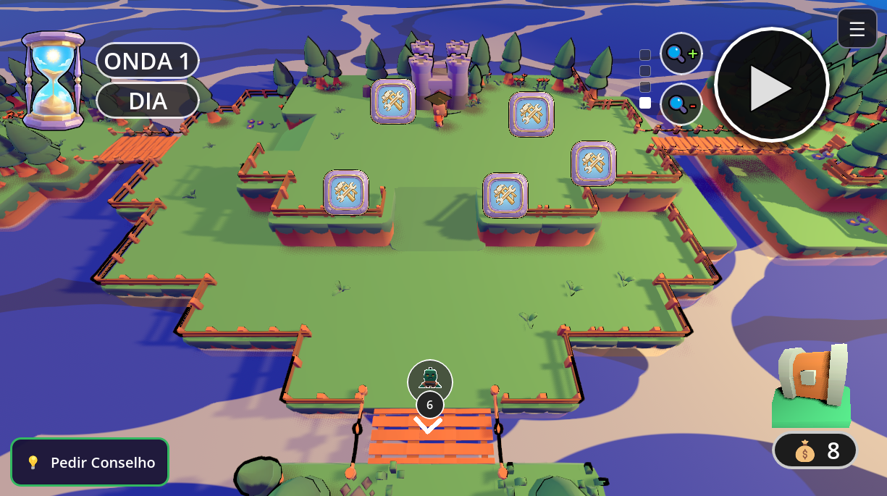
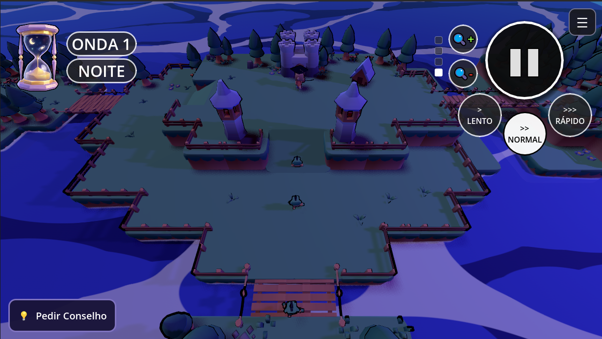
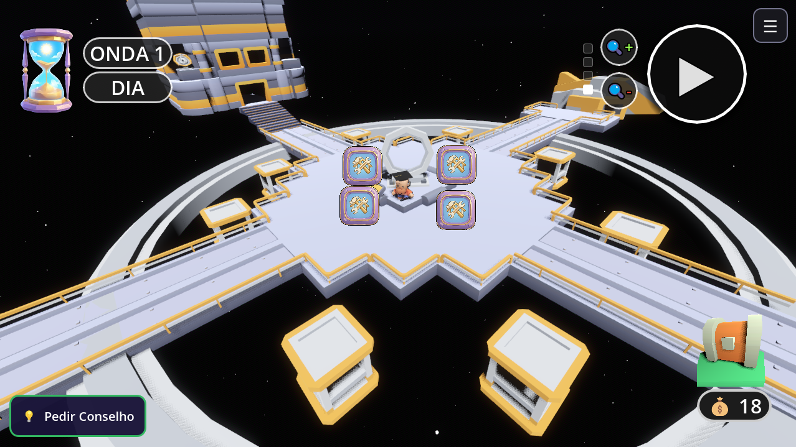
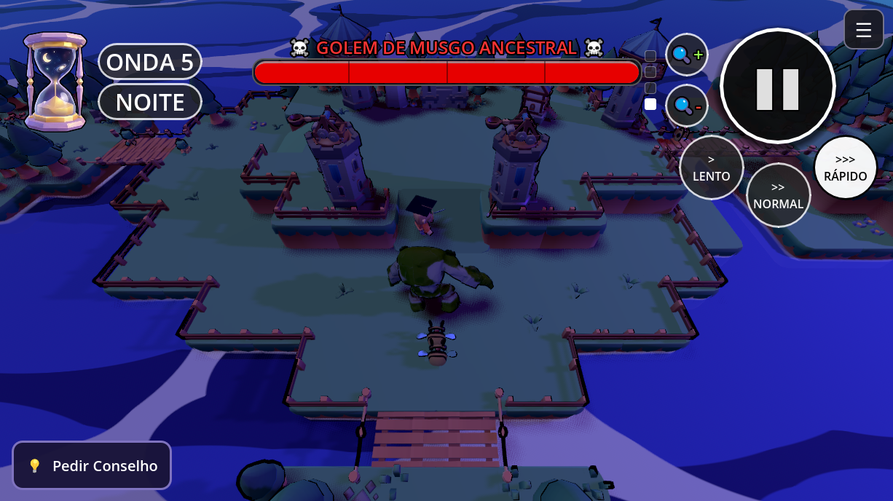
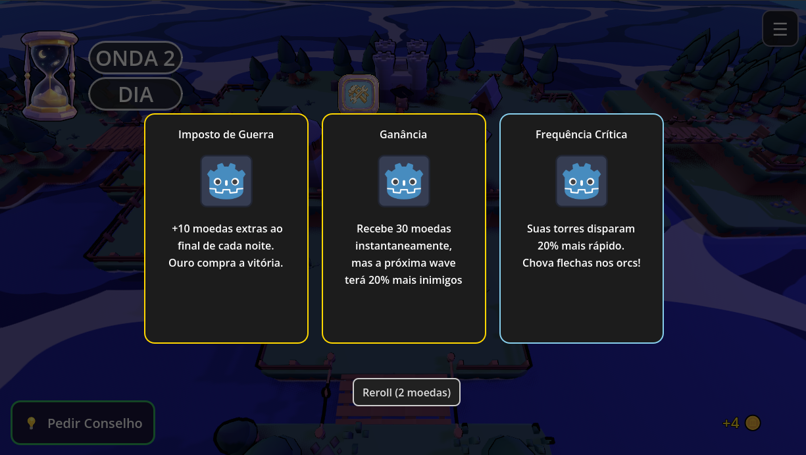
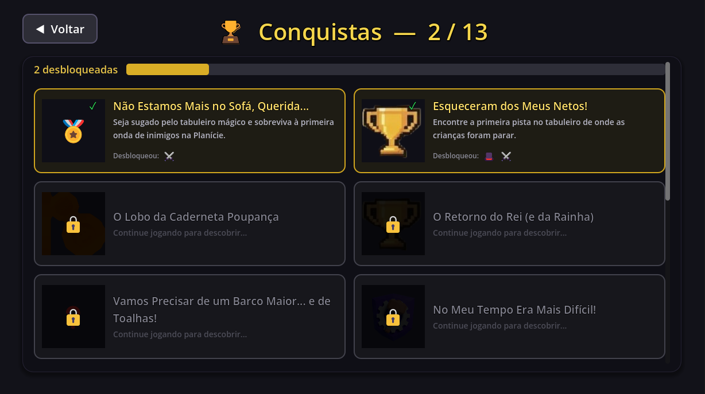
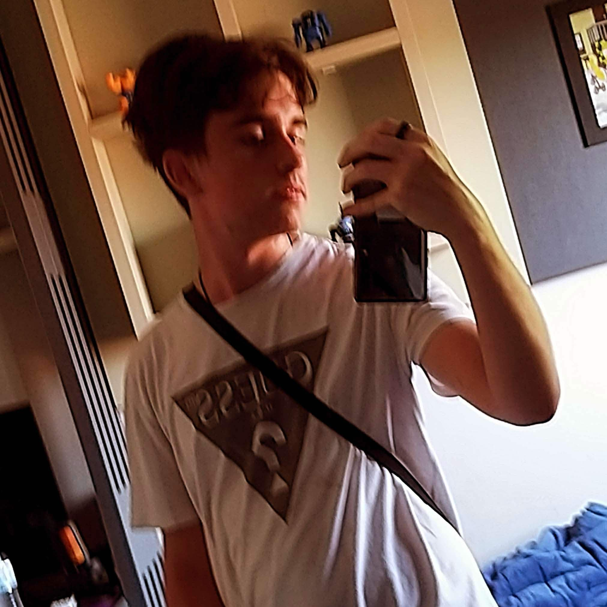

<div align="center">


# Onde Estão os Netos?

**Tower Defense · Ação · Estratégia**

_Avós heroicos atravessam mundos fantásticos para resgatar seus netos_

<br/>

[](https://godotengine.org)
[](https://docs.godotengine.org/en/stable/tutorials/scripting/gdscript/)
[](.)
[](.)
[](.)

</div>

---

## Índice

1. [Sobre o Projeto](#sobre-o-projeto)
2. [Screenshots](#screenshots)
3. [Funcionalidades](#funcionalidades)
4. [Mundos do Jogo](#mundos-do-jogo)
5. [Arquitetura & Sistemas](#arquitetura--sistemas)
6. [Estrutura de Pastas](#estrutura-de-pastas)
7. [Instalação](#instalação)
8. [Como Jogar](#como-jogar)
9. [Equipe](#equipe)

---

## Sobre o Projeto

**Onde Estão os Netos?** é um jogo _indie_ de **Tower Defense com Ação**, desenvolvido como Projeto Integrador IV (PI-4).

### A História

Uma família é sugada para dentro de um antigo jogo de tabuleiro. Os avós **Afonso** e **Berta** precisam atravessar seis mundos perigosos — cada um com temática, inimigos e desafios únicos — para resgatar seus netos e voltar para casa.

### Proposta de Acessibilidade

O jogo foi projetado desde o início para o **público idoso**:

| Decisão de Design                            | Benefício                                 |
| -------------------------------------------- | ----------------------------------------- |
| Interface com fontes grandes e ícones claros | Leitura confortável                       |
| Duas fases bem definidas (Dia / Noite)       | Ritmo previsível, sem pressa              |
| Câmera isométrica fixa                       | Sem desorientação espacial                |
| Controle inteiramente por toque ou clique    | Sem necessidade de teclado ou gamepad     |
| Trilha sonora Lo-fi / Bossa Nova             | Experiência relaxante e de baixo estresse |
| Combate automático das torres                | Foco em estratégia, não em reflexos       |

---

## Screenshots

<div align="center">

|                                                                                       |                                                                                      |
| :-----------------------------------------------------------------------------------: | :----------------------------------------------------------------------------------: |
|  |  |
|                     _Fase de Preparação — construção de defesas_                      |                        _Fase de Combate — ondas de inimigos_                         |
|    |      |
|                              _Deserto Carmesim — Mapa 2_                              |                               _Batalha contra o Boss_                                |
|    |           |
|                           _Seleção de Power-up (Roguelike)_                           |                               _Sistema de Conquistas_                                |

> 📸 Adicione as capturas de tela reais na pasta `docs/screenshots/`

</div>

---

## Funcionalidades

### 🌅 Fase de Preparação (Dia)

- Construção e posicionamento estratégico de torres e edificações
- Sistema de **slots de construção** com gerenciamento global via `BuildSlotManager`
- Gerenciamento de moedas com fontes de renda passiva (minas, mercados, moinhos)
- Sistema de **upgrade em dois níveis** para cada estrutura
- **Conselheiro IA** — analisa a situação e sugere ações prioritárias em tempo real

### 🌙 Fase de Confronto (Noite)

- Ondas de inimigos configuráveis via recursos `.tres` (`WaveResource`)
- IA de inimigos com navegação 3D via `NavigationAgent3D`
- Inimigos com comportamentos distintos: normal, kamikaze, necromante/invocador, aéreo
- Mini-bosses e bosses com barra de vida dedicada na HUD

### 🎴 Sistema de Cartas (Roguelike)

Ao final de cada fase, o jogador escolhe **uma carta de power-up** entre três opções:

| Carta                | Efeito                               |
| -------------------- | ------------------------------------ |
| Balística Pesada     | Aumenta dano das torres de projétil  |
| Engenharia Eficiente | Reduz custo de construção            |
| Frequência Crítica   | Aumenta chance de ataque crítico     |
| Fúria                | Aumenta velocidade de ataque geral   |
| Gelo                 | Torres aplicam lentidão nos inimigos |
| Imposto de Guerra    | Aumenta renda por onda               |
| Muralhas Reforçadas  | Aumenta HP de todas as estruturas    |

### 🏆 Conquistas

12 conquistas desbloqueáveis que recompensam diferentes estilos de jogo:

| Conquista                | Condição                                |
| ------------------------ | --------------------------------------- |
| Querida, Encolhi os Avós | Inicia a aventura                       |
| Primeiros Passos         | Completa o tutorial                     |
| Primeira Compra          | Constrói a primeira torre               |
| Defesa Perfeita          | Completa uma fase sem perder HP de base |
| Derrota o Boss Sem Dano  | Vence um boss com a base intacta        |
| Acumula 1.000 Moedas     | Acumula riqueza                         |
| Poder Espacial           | Completa o mapa do espaço               |
| Chega à Fase Final       | Desbloqueia o covil do dragão           |

### 🤖 Conselheiro IA

Sistema original de recomendações em tempo real (`conselheiro_ia.gd`):

- Analisa renda por onda, HP da base, slots livres e nível de ameaça
- Classifica sugestões em **Urgente / Alta / Média / Baixa** prioridade
- Indica construções específicas com justificativa ao jogador

### ⚖️ Balanceamento por CSV

- Multiplicadores de vida, dano e velocidade lidos de arquivo CSV em tempo de execução
- Ajuste de dificuldade sem rebuild — basta editar o CSV
- Valores-base definidos nas cenas; o CSV aplica multiplicadores globais por cima

---

## Mundos do Jogo

| #   | Mundo                              | Tema                | Inimigos                         | Boss           |
| --- | ---------------------------------- | ------------------- | -------------------------------- | -------------- |
| 1   | **Floresta Medieval** _(Tutorial)_ | Medieval / Fantasia | Orc, Cogumelo, Abelha            | —              |
| 2   | **Deserto Carmesim**               | Egípcio             | Anubis, Chacal, Gênio            | Faraó          |
| 3   | **Mansão Assombrada**              | Terror              | Bruxa, Lich                      | —              |
| 4   | **Fenda dos Piratas**              | Oceano              | Peixe, Tubarão                   | Capitão Pirata |
| 5   | **Planeta Maluco**                 | Sci-Fi / Espaço     | Flamingo Astronauta, Robô Voador | —              |
| 6   | **Covil do Dragão** _(Final)_      | Vulcão              | Golem de Lava                    | Dragão         |

Cada mundo possui: mapa único com NavMesh própria, set de inimigos exclusivo, base temática e trilha sonora específica.

---

## Arquitetura & Sistemas

### Autoloads (Singletons)

```
GameManager        — Estado central: moedas, ondas, modo infinito
Global             — Progresso do jogador, save/load, inimigos descobertos
Balanceamento      — Parser CSV + multiplicadores globais de dificuldade
MusicaGlobal       — Gerenciamento de trilha sonora entre cenas
BuildSlotManager   — Controle de slots de construção disponíveis no mapa
PopupConquista     — Notificação de conquistas desbloqueadas
TelaAvisoInimigo   — Apresentação de novo inimigo (estilo enciclopédia)
AiMemory           — Memória de estado para o Conselheiro IA
```

### Fluxo de Onda

```
[Fase de Dia]
  Jogador constrói e posiciona estruturas
  Conselheiro IA sugere prioridades
         │
         ▼ (toca em "▶" para iniciar)
[Fase de Noite]
  GameManager carrega WaveResource
  Inimigos são instanciados com NavigationAgent3D
         │
         ▼
[Combate]
  Torres atacam automaticamente por raio de visão
  Jogador controla velocidade: 0.5× · 1× · 2×
  Jogador pode pausar a qualquer momento
         │
         ▼
[Fim de Onda]
  Recompensa de moedas + seleção de carta roguelike
  Próxima onda ou fim de fase
```

---

## Estrutura de Pastas

```
pi-4/
├── docs/
│   ├── banner.png
│   └── screenshots/          # Capturas de tela do jogo
│
├── Maps/                     # Cenas dos 6 mundos (.tscn + .gd por mapa)
├── Builds/                   # Estruturas construíveis
│   ├── tower.tscn            # Torre base
│   ├── sniper.tscn           # Longo alcance
│   ├── morteiro.tscn         # Dano em área
│   ├── torre_de_fogo.tscn    # Dano contínuo
│   ├── torre_de_tesla.tscn   # Dano em cadeia
│   ├── quartel.tscn          # Produz aliados
│   ├── mina.tscn / mercado.tscn / mill.tscn   # Renda passiva
│   └── [bases temáticas]     # castle, Gate, piramede, BarcoBase, Jaula, Cripta
│
├── Enemys/                   # Cenas e IA base de todos os inimigos
├── Waves/                    # Recursos de configuração de onda
├── Upgrades/                 # Cenas de upgrade visual das estruturas
├── PowerUps/                 # Cartas de power-up (sistema roguelike)
├── Conquistas/               # Dados de conquistas (.tres)
│
├── Scripts Globais/          # Autoloads e sistemas centrais
│   ├── game_manager.gd
│   ├── Builds.gd
│   ├── Global.gd
│   ├── Balanceamento.gd
│   ├── BuildSlotManager.gd
│   └── conselheiro_ia.gd
│
├── Scripts Locais/           # Scripts específicos por cena
├── UI/HUD/                   # Interface e controles mobile
│   └── controles_mobile.gd  # Toque, zoom e velocidade do jogo
│
├── Personagens/              # Modelos e scripts dos personagens jogáveis
├── Assets/                   # Assets visuais de terceiros
├── Musicas/ & Sons/          # Trilha sonora e efeitos
├── Shaders/                  # Shaders customizados
├── Balanceamento/            # Arquivos CSV de balanceamento
└── project.godot
```

---

## Instalação

### Requisitos

| Ferramenta                                       | Versão                               |
| ------------------------------------------------ | ------------------------------------ |
| [Godot Engine](https://godotengine.org/download) | **4.6** (Forward Plus)               |
| Sistema Operacional                              | Windows 10/11 ou Android 8+          |
| GPU                                              | Compatível com Direct3D 12 (Windows) |

### Passos

```bash
# 1. Clone o repositório
git clone https://github.com/LucasSckenal/pi-4.git
cd pi-4

# 2. Abra o Godot 4.6
#    File > Import Project > selecione a pasta pi-4/

# 3. Aguarde a importação de assets (.glb, texturas, etc.)

# 4. Execute com F5 ou clique em "Run Project"
```

> **Nota:** o projeto usa **Jolt Physics** e renderização **D3D12**. Use exatamente o Godot 4.6 para evitar incompatibilidades.

---

## Como Jogar

O jogo é controlado inteiramente por **toque** (Android) ou **clique** (PC) — sem necessidade de teclado ou gamepad.

### HUD — Controles na Tela

| Botão             | Fase            | Ação                          |
| ----------------- | --------------- | ----------------------------- |
| **▶**             | Dia             | Inicia a onda de inimigos     |
| **❚❚**            | Noite           | Pausa o jogo                  |
| **▶❚**            | Noite (pausado) | Retoma o jogo                 |
| **🔍+** / **🔍−** | Qualquer        | Zoom in / Zoom out (4 níveis) |

### Controle de Velocidade

Durante a fase de noite, três botões aparecem na HUD para controlar o ritmo do combate:

| Botão            | Velocidade | Uso                                       |
| ---------------- | ---------- | ----------------------------------------- |
| **`> LENTO`**    | 0.5×       | Analise situações difíceis com mais calma |
| **`>> NORMAL`**  | 1×         | Velocidade padrão                         |
| **`>>> RÁPIDO`** | 2×         | Acelere ondas fáceis                      |

### Loop de Jogo

1. **Explore o mapa** — identifique os slots de construção disponíveis
2. **Invista em renda** — construa minas e mercados antes de torres
3. **Posicione as defesas** — aproveite choke points e coberturas cruzadas
4. **Consulte o Conselheiro IA** — veja as sugestões de prioridade na HUD
5. **Inicie a onda (▶)** — defenda a base até o último inimigo cair
6. **Escolha sua carta** — cada fase concede um power-up permanente
7. **Avance ao próximo mundo** — complete todas as ondas para desbloquear o mapa seguinte

---

## Equipe

<div align="center">

<table>
  <tr>
    <td align="center" width="200">
      <a href="https://www.behance.net/anaescher">
        
      </a><br/><br/>
      <b>Ana Luiza Escher</b><br/>
      <sub>Design</sub>
    </td>
    <td align="center" width="200">
      <a href="https://www.linkedin.com/in/henrique-luan-fritz-70412635a">
        
      </a><br/><br/>
      <b>Henrique Luan Fritz</b><br/>
      <sub>Ciência da Computação</sub>
    </td>
    <td align="center" width="200">
      <a href="https://www.linkedin.com/in/luan-vitor-casali-dallabrida">
        
      </a><br/><br/>
      <b>Luan Vitor C. D.</b><br/>
      <sub>Ciência da Computação</sub>
    </td>
    <td align="center" width="200">
      <a href="https://linkedin.com/in/lucassckenal">
        
      </a><br/><br/>
      <b>Lucas P. Sckenal</b><br/>
      <sub>Ciência da Computação</sub>
    </td>
  </tr>
</table>

_Projeto Integrador IV (PI-4) — SENAC · 2025_

</div>

---

## Licença

Este projeto foi desenvolvido para fins **acadêmicos**. Assets de terceiros utilizados estão sob suas respectivas licenças (consulte os créditos nas pastas `Assets/`).
