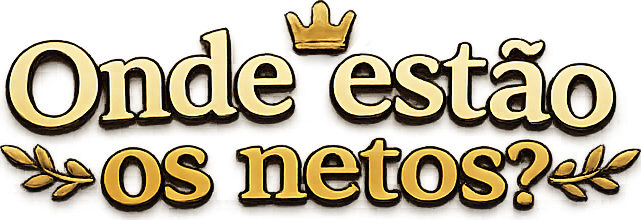
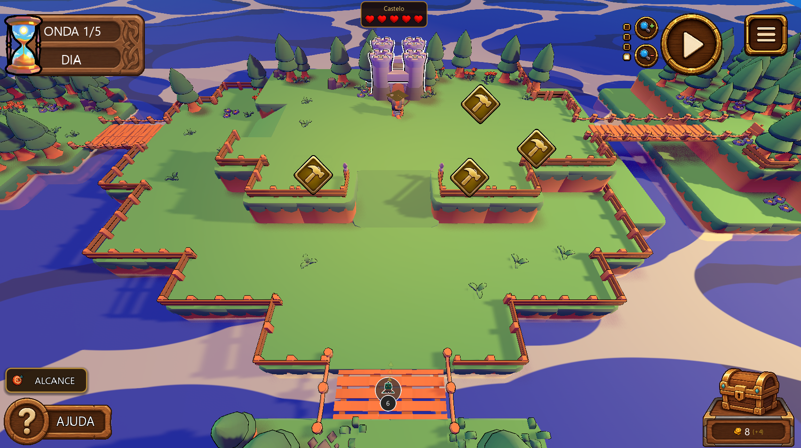
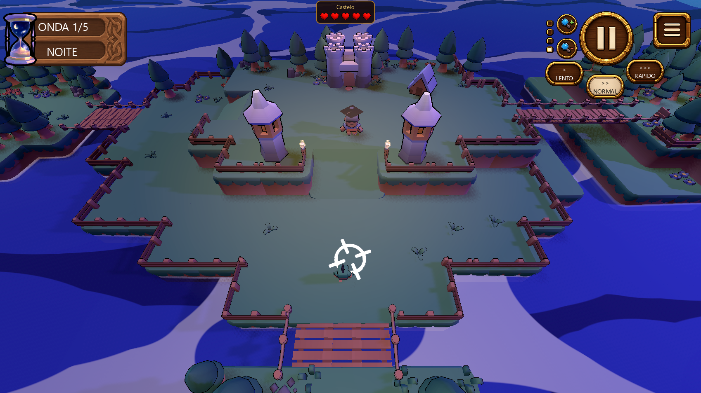
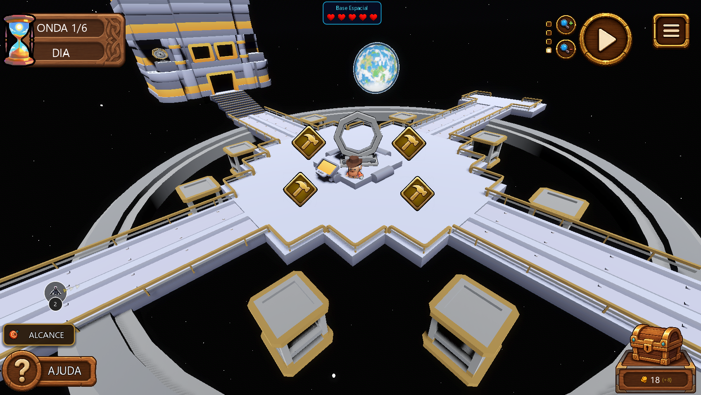
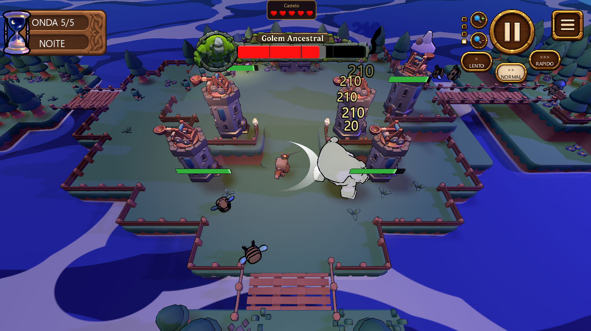
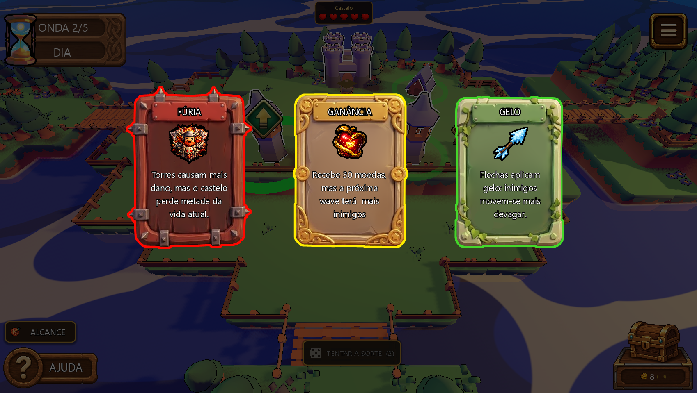
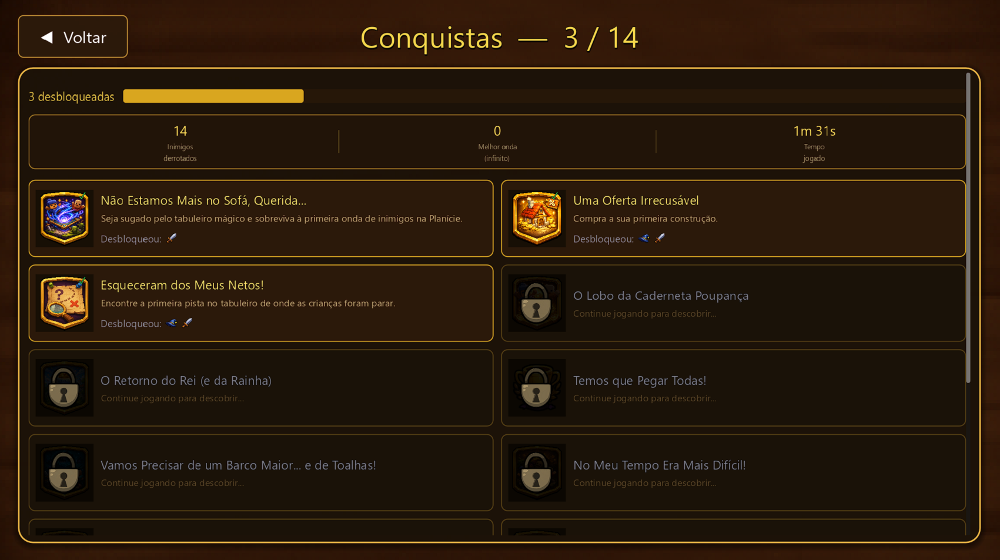
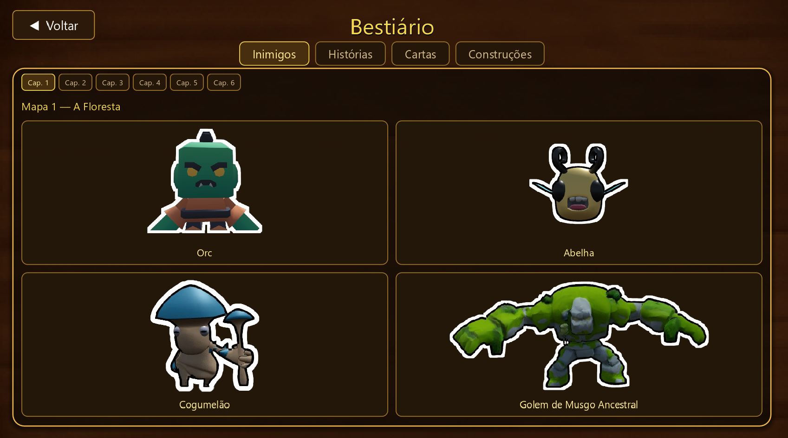
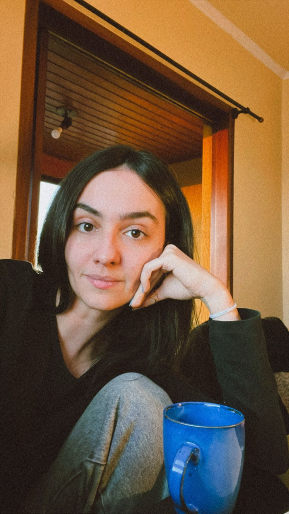
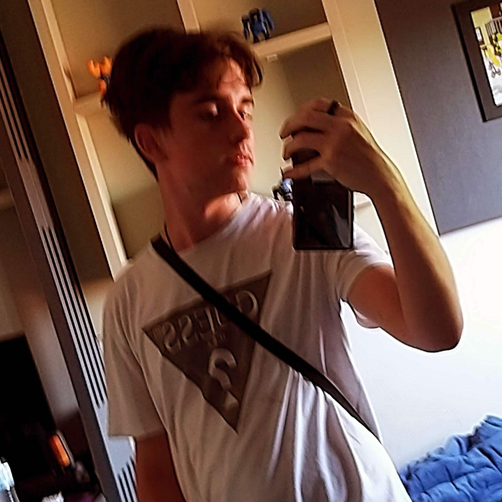

<div align="center">




**Tower Defense · Ação · Estratégia · Roguelike**

_Avós heroicos atravessam mundos fantásticos para resgatar seus netos_

<br/>

[](https://godotengine.org)
[](https://docs.godotengine.org/en/stable/tutorials/scripting/gdscript/)
[](https://github.com/LucasSckenal/pi-4/releases/latest)
[](https://github.com/LucasSckenal/pi-4/releases/latest)

<br/>

### ⬇️ Baixe e jogue agora

[](https://github.com/LucasSckenal/pi-4/releases/download/v3.5/OndeEstaoOsNetos_Windows_v3.5.zip)
[](https://github.com/LucasSckenal/pi-4/releases/download/v3.5/OndeEstaoOsNetos_Android_v3.5.apk)

<sub>Última versão: <b>v4.0</b> · <a href="https://github.com/LucasSckenal/pi-4/releases">ver todos os releases</a></sub>

</div>

---

## Índice

1. [Sobre o Projeto](#sobre-o-projeto)
2. [Baixar e Jogar](#baixar-e-jogar)
3. [Screenshots](#screenshots)
4. [Funcionalidades](#funcionalidades)
5. [Construções](#construções)
6. [Mundos do Jogo](#mundos-do-jogo)
7. [O Bestiário (o "livro")](#o-bestiário-o-livro)
8. [Arquitetura & Sistemas](#arquitetura--sistemas)
9. [Estrutura de Pastas](#estrutura-de-pastas)
10. [Rodar a partir do código](#instalação)
11. [Como Jogar](#como-jogar)
12. [Equipe](#equipe)
13. [Créditos](#créditos)
14. [Licença](#licença)

---

## Sobre o Projeto

**Onde Estão os Netos?** é um jogo _indie_ de **Tower Defense com Ação e progressão Roguelike**, desenvolvido como Projeto Integrador IV (PI-4).

### A História

Uma família é sugada para dentro de um antigo jogo de tabuleiro. Os avós **Afonso** e **Berta** precisam atravessar seis mundos perigosos — cada um com temática, inimigos e desafios únicos — para resgatar seus netos e voltar para casa.

### Proposta de Acessibilidade

O jogo foi projetado desde o início para o **público idoso**. Cada decisão de interface prioriza leitura confortável, baixo estresse e ritmo previsível:

| Decisão de Design                                  | Benefício                                 |
| -------------------------------------------------- | ----------------------------------------- |
| Fontes grandes, ícones claros e alvos de toque amplos | Leitura e interação confortáveis      |
| Duas fases bem definidas (Dia / Noite)             | Ritmo previsível, sem pressa              |
| Câmera isométrica fixa                             | Sem desorientação espacial                |
| Controle inteiramente por toque ou clique          | Sem necessidade de teclado ou gamepad     |
| Combate automático das torres                      | Foco em estratégia, não em reflexos       |
| Conselheiro IA que sugere a próxima jogada         | Reduz a curva de aprendizado              |
| Trilha sonora Lo-fi / Bossa Nova                   | Experiência relaxante                     |

---

## Baixar e Jogar

A forma mais rápida de jogar — **sem precisar instalar o Godot**:

| Plataforma     | Download                                                                                                                          | Como rodar                                                       |
| -------------- | ------------------------------------------------------------------------------------------------------------------------------- | --------------------------------------------------------------- |
| 🪟 **Windows** | [`OndeEstaoOsNetos_Windows_v3.5.zip`](https://github.com/LucasSckenal/pi-4/releases/download/v3.5/OndeEstaoOsNetos_Windows_v3.5.zip) | Extraia o `.zip` e execute o `.exe`                             |
| 🤖 **Android** | [`OndeEstaoOsNetos_Android_v3.5.apk`](https://github.com/LucasSckenal/pi-4/releases/download/v3.5/OndeEstaoOsNetos_Android_v3.5.apk) | Baixe o `.apk` e instale (permita instalar de "fontes desconhecidas") |

> 📦 A versão mais recente fica sempre em **[Releases](https://github.com/LucasSckenal/pi-4/releases/latest)**.
> Quer rodar a partir do código-fonte? Veja [Rodar a partir do código](#instalação).

---

## Screenshots

<div align="center">


<br/>
<sub><i>Gameplay — preparação no Dia e defesa na Noite <!-- Substitua docs/gameplay.gif por um GIF real de gameplay --></i></sub>

<br/><br/>

|                                                                                       |                                                                                      |
| :-----------------------------------------------------------------------------------: | :----------------------------------------------------------------------------------: |
|  |  |
|                     _Fase de Preparação — construção de defesas_                       |                        _Fase de Combate — ondas de inimigos_                         |
|     |      |
|                                  _Odisseia — Mapa 5_                                    |                               _Batalha contra o Boss_                                |
|     |           |
|                           _Seleção de Power-up (Roguelike)_                             |                               _Sistema de Conquistas_                                |

</div>

---

## Funcionalidades

### 🌅 Fase de Preparação (Dia)

- **Menu radial de construção** com preview da estrutura, custo e descrição
- Sistema de **slots de construção** gerenciado globalmente via `BuildSlotManager`
- **Casa** como base de economia, evoluível em caminhos de renda (**Mina**, **Moinho**, **Mercado**)
- **Conselheiro IA (Berta)** — analisa a situação e sugere a construção prioritária em tempo real
- **Botão "Ver alcance"** — exibe o raio de todas as torres com um toque, sem precisar selecioná-las

### 🌙 Fase de Confronto (Noite)

- Ondas de inimigos configuráveis via recursos `.tres` (`WaveResource`)
- IA de inimigos com navegação 3D via `NavigationAgent3D`
- Comportamentos distintos: terrestre, **aéreo**, **kamikaze** e **invocador** (a Bruxa convoca aprendizes)
- **Soldados aliados** do Quartel que perseguem e combatem os inimigos, com renascimento automático — ou, pelo caminho da **Taverna**, um **Pirata** tanque e um **Bardo** de suporte que segue o pirata
- Mini-chefes e chefes com **barra de vida dedicada** e cutscenes de apresentação
- Controle de velocidade **0.5× / 1× / 2×** e pausa a qualquer momento

### 🎴 Sistema de Cartas (Roguelike)

Ao final de cada onda, o jogador escolhe **uma carta de power-up** entre três sorteadas, com a opção de **rerolar** (botão _"Tentar a Sorte"_, por um custo de moedas).

São **mais de 30 cartas distintas** — cada uma com um efeito mecânico único — organizadas em três famílias, identificadas pela cor da carta:

| 🔴 Ofensivas                          | 🟡 Economia                         | 🔵 Defesa / Utilidade                 |
| ------------------------------------- | ----------------------------------- | ------------------------------------- |
| Mais dano, crítico, alcance, ricochete | Mais ouro por onda, abate e início  | Mais vida da base e das torres        |
| Dano em chefes / aéreos / execução    | Renda extra das construções         | Espinhos, lentidão, menos inimigos    |
| Veneno, fogo, dano crescente por onda  | Reroll grátis, 1ª construção grátis | Mais soldados, soldados mais fortes   |
| A base também ataca como uma torre     | Ouro por onda sem perder vida       | Construções explodem ao serem destruídas |

> Cada carta pega fica registrada na coleção do jogador e aparece no **Bestiário**.

### 🏰 Progressão de Construções

- **Torre** evoluível em vários ramos: **Morteiro** (área), **Sniper** (longo alcance), **Torre de Fogo** (queima vários alvos), **Tesla** (dano em cadeia) e **Caldeirão** (veneno em área)
- **Casa** é a base da economia e, ao ser melhorada, escolhe um caminho de renda: **Mina**, **Moinho** ou **Mercado** — cada um rende de um jeito (o Mercado é exclusivo do Deserto Carmesim)
- **Quartel** escolhe um caminho defensivo: **Guarda Real** (mistura arqueiros com espadachins corpo a corpo) ou, na Fenda dos Piratas, a **Taverna dos Piratas** — que troca os soldados por um **Pirata** tanque e um **Bardo** de suporte, cuja aura dá **+20% de dano e cadência** a torres, aliados e ao jogador por perto
- Melhorar uma construção **restaura sua vida** e adapta seu tamanho/alcance ao mapa
- Caminhos de melhoria com **restrição por fase** (ex.: a Taverna só aparece na Fenda dos Piratas), facilitando a vida do jogador com menos botões por mapa

### 📖 Bestiário ("o livro")

Uma enciclopédia no menu principal com **quatro abas**, no estilo de um livro com folhear de páginas:

- **Inimigos** — dossiê de cada inimigo (lore, comportamento, fraqueza, primeiro avistamento), revelado ao encontrá-lo
- **Histórias** — as cutscenes/contexto de cada mapa já liberado
- **Cartas** — a coleção de power-ups já obtidos, com contador (ex.: `18/30`)
- **Construções** — todas as construções descobertas (reveladas ao construí-las), com contador

### 🏆 Conquistas

14 conquistas desbloqueáveis que recompensam diferentes estilos de jogo (iniciar a aventura, completar o tutorial, defesa perfeita, derrotar um chefe sem dano, acumular riqueza, alcançar a fase final, etc.).

### 🤖 Conselheiro IA

Sistema original de recomendações em tempo real (`conselheiro_ia.gd`):

- Analisa renda por onda, HP da base, slots livres e nível de ameaça
- Classifica sugestões em **Urgente / Alta / Média / Baixa** prioridade
- Destaca a construção recomendada diretamente no menu radial

### ⚖️ Balanceamento por CSV

- Vida, dano, custo e velocidade lidos de `balanceamento.csv` em tempo de execução
- Ajuste de dificuldade **sem rebuild** — basta editar o CSV
- Valores-base nas cenas; o CSV aplica os valores oficiais por cima

---

## Construções

| Construção             | Tipo     | Função                                                        | Disponibilidade   |
| ---------------------- | -------- | ------------------------------------------------------------ | ----------------- |
| **Torre**              | Ofensiva | Atira flechas; evolui em vários ramos                        | Todos os mapas    |
| **Morteiro**           | Ofensiva | Bombas explosivas em área (ramo da Torre)                    | Upgrade           |
| **Sniper**             | Ofensiva | Tiros certeiros de longo alcance (ramo da Torre)             | Upgrade           |
| **Torre de Fogo**      | Ofensiva | Queima vários inimigos ao mesmo tempo (ramo da Torre)        | Covil do Dragão   |
| **Tesla**              | Ofensiva | Raios que saltam entre inimigos (ramo da Torre)              | Planeta Maluco    |
| **Caldeirão**          | Ofensiva | Área de veneno e dano contínuo (ramo da Torre)               | Casa da Bruxa     |
| **Quartel**            | Defesa   | Solta soldados; evolui em **Guarda Real** ou **Taverna**     | Todos os mapas    |
| **Guarda Real**        | Defesa   | Arqueiros + espadachins corpo a corpo (caminho do Quartel)   | Upgrade           |
| **Taverna dos Piratas**| Defesa   | Troca soldados por **Pirata** (tanque) + **Bardo** (buff de dano/cadência) — caminho do Quartel | Fenda dos Piratas |
| **Casa**               | Economia | Renda passiva; evolui em **Mina**, **Moinho** ou **Mercado** | Todos os mapas    |
| **Mina**               | Economia | Mais ouro por onda (caminho da Casa)                         | Upgrade           |
| **Moinho**             | Economia | Renda crescente por onda (caminho da Casa)                   | Upgrade           |
| **Mercado Egípcio**    | Economia | Renda alta (caminho da Casa)                                 | Deserto Carmesim  |

---

## Mundos do Jogo

| #   | Mundo                              | Tema                | Inimigos Comuns                                          | Mini-chefe  | Chefe                  |
| --- | ---------------------------------- | ------------------- | ------------------------------------------------------- | ----------- | ---------------------- |
| 1   | **A Floresta** _(Tutorial)_        | Medieval / Fantasia | Orc, Abelha, Cogumelão                                  | —           | Golem de Musgo Ancestral |
| 2   | **O Deserto Carmesim**             | Egípcio             | Chacal, Anubis, Gênio, Servo do Deserto                 | Litch       | Faraó                  |
| 3   | **A Casa da Bruxa**                | Terror              | Abóbora, Bilbo, Aprendiz da Bruxa                       | Cavaleiro   | Bruxa                  |
| 4   | **A Fenda dos Piratas**            | Oceano / Pirata     | Monstro Peixe, Bombardeiro                              | Tutuba      | Holandês Voador        |
| 5   | **O Planeta Maluco**               | Sci-Fi / Espaço     | Alexa, Linígena, Sapão, Fernando o Flamingo, Tentáculo  | —           | Cosmic Kraken          |
| 6   | **O Covil do Dragão** _(Final)_    | Vulcão              | Demoniozinho                                            | Lava Golem  | Dragão (3 formas)      |

Cada mundo possui mapa único com NavMesh própria, set de inimigos exclusivo, base temática e trilha sonora específica.

---

## O Bestiário (o "livro")

O Bestiário é o coração colecionável do jogo e reforça a **rejogabilidade**. Cada aba revela conteúdo conforme o jogador progride:

| Aba             | O que mostra                                  | Como liberar              |
| --------------- | --------------------------------------------- | ------------------------- |
| **Inimigos**    | Dossiê completo (mais de 30 inimigos)         | Encontrar o inimigo       |
| **Histórias**   | Cutscenes/contexto dos mapas                  | Liberar o mapa            |
| **Cartas**      | Coleção de power-ups (contador X/N)           | Pegar a carta numa partida|
| **Construções** | Todas as construções e seus caminhos          | Construí-la uma vez       |

Conteúdo ainda não descoberto aparece como **"???"**, incentivando a exploração de todos os mundos e estratégias.

<div align="center">

<br/>
<sub><i>O Bestiário — enciclopédia colecionável de inimigos, histórias, cartas e construções</i></sub>
</div>

---

## Arquitetura & Sistemas

### Destaques de Engenharia

Sistemas próprios que vão além de um tower defense básico — pensados para manutenção fácil e expansão por dados:

- **Caminhos de upgrade como `Resource` (`UpgradePathData`)** — cada construção ramifica em vários caminhos definidos por dados (custo, modelo, stats, composição de aliados, restrição por fase), **sem escrever código novo**. É o que faz a Casa virar Mina/Moinho/Mercado e o Quartel virar Guarda Real/Taverna.
- **Conselheiro IA (`conselheiro_ia.gd`)** — analisa renda por onda, HP da base, slots livres e nível de ameaça, classifica sugestões em **Urgente / Alta / Média / Baixa** e destaca a jogada diretamente no menu radial.
- **Aura do Bardo (buff "puxado")** — em vez de cada bardo empurrar bônus, cada torre/aliado/jogador consulta `GameManager.fator_buff_bardo()` na hora de atacar: **não acumula** e tem custo zero quando não há bardo em campo.
- **Balanceamento por CSV em runtime** — vida, dano, custo e velocidade lidos de `balanceamento.csv` por cima das cenas: ajuste de dificuldade **sem rebuild**.
- **Descoberta progressiva do Bestiário** — inimigos, cartas, histórias e construções revelados conforme o jogador encontra/usa, com persistência no save.
- **Tutorial guiado dirigido por dados** — passos encadeados (diálogos, foco em alvos 3D/2D, seta animada, espera por sinais) que ensinam os sistemas sem travar o jogador.

### Autoloads (Singletons)

```
GameManager        — Estado da partida: moedas, ondas, cartas, modo infinito
Global             — Progresso, save/load, descobertas (inimigos, cartas, construções)
Balanceamento      — Parser CSV dos valores oficiais de balanceamento
BuildSlotManager   — Controle dos slots de construção do mapa
MusicaGlobal       — Trilha sonora persistente entre cenas
SFXManager         — Efeitos sonoros (cliques, construção, hit, reroll, derrota)
CursorManager      — Cursor contextual do jogo
PopupConquista     — Notificações de conquistas desbloqueadas
TelaAvisoInimigo   — Apresentação de novo inimigo (estilo enciclopédia)
AiMemory           — Memória de estado para o Conselheiro IA
```

### Fluxo de Onda

```
[Fase de Dia]
  Jogador constrói e posiciona estruturas
  Conselheiro IA sugere prioridades · "Ver alcance" mostra os raios
         │
         ▼ (toca em "▶" para iniciar)
[Fase de Noite]
  GameManager carrega a WaveResource
  Inimigos instanciados com NavigationAgent3D
         │
         ▼
[Combate]
  Torres e soldados atacam automaticamente
  Jogador controla velocidade: 0.5× · 1× · 2× e pode pausar
         │
         ▼
[Fim de Onda]
  Recompensa de moedas + escolha de carta roguelike (com reroll)
  Próxima onda ou fim de fase
```

---

## Estrutura de Pastas

```
pi-4/
├── docs/                     # Banner, screenshots e fotos da equipe
│
├── Maps/                     # Cenas dos 6 mundos
├── Gridmap/                  # Layouts de grid / NavMesh
├── Builds/                   # Estruturas construíveis (.tscn)
│   ├── tower.tscn            # Torre base (+ ramos Morteiro/Sniper/Fogo/Tesla/Caldeirão)
│   ├── quartel.tscn          # Produz soldados (caminhos Guarda Real / Taverna)
│   ├── house.tscn            # Casa: base da economia (caminhos Mina / Moinho / Mercado)
│   ├── taverna_dos_piratas.glb # Modelo da Taverna (caminho do Quartel)
│   └── [bases temáticas]     # castle, Gate, piramede, BarcoBase, jaula, cripta
│
├── Enemies/                  # IA base (inimigo_base.gd) + cenas por mapa (Map 1…6)
├── Waves/                    # Recursos de configuração de onda (WaveResource)
├── Upgrades/                 # UpgradePathData + cenas de upgrade visual
├── PowerUps/                 # Cartas roguelike (carta_upgrade.gd + .tres)
├── Bestiario/                # Catálogo do bestiário (bestiario_dados.gd)
├── Conquistas/               # Dados de conquistas (.tres)
│
├── Scripts Globais/          # Autoloads e sistemas centrais
│   ├── game_manager.gd · Global.gd · Balanceamento.gd
│   ├── Builds.gd             # Lógica de TODAS as construções
│   ├── BuildSlotManager.gd · conselheiro_ia.gd
│   └── gerenciador_sfx.gd · cursor_manager.gd
│
├── Scripts Locais/           # Scripts por cena
│   ├── hud.gd · radial_menu.gd · build_slot.gd
│   ├── soldier.gd · carta_ui.gd · opcao_upgrade_button.gd · Player.gd
│
├── UI/
│   ├── HUD/                  # HUD, painel do Conselheiro
│   ├── Menus/                # Bestiário, menu de pausa
│   └── Upgrade/              # Painel de melhoria de construção
│
├── Shaders/                  # veneno_circulo, wood_desk, page_curl, parchment, Outline
├── Balanceamento/            # balanceamento.csv
├── Modelos_3D/               # Modelos 3D (personagens, inimigos, construções, armas)
├── Assets/ · Icons/          # Arte 2D, ícones de UI
├── Audio/                    # Trilha sonora e efeitos
├── android/                  # Configuração de exportação Android
└── project.godot
```

---

## Instalação

> 🎮 **Só quer jogar?** Baixe o build pronto em [Baixar e Jogar](#baixar-e-jogar) — não precisa de Godot. Os passos abaixo são para **rodar/editar o projeto** a partir do código-fonte.

### Requisitos

| Ferramenta                                       | Versão                               |
| ------------------------------------------------ | ------------------------------------ |
| [Godot Engine](https://godotengine.org/download) | **4.6** (Forward Plus)               |
| Sistema Operacional                              | Windows 10/11 ou Android 8+          |
| GPU                                              | Compatível com Direct3D 12 (Windows) |

### Passos

```bash
# 1. Clone o repositório
git clone https://github.com/LucasSckenal/pi-4.git
cd pi-4

# 2. Abra o Godot 4.6
#    Import Project > selecione a pasta pi-4/

# 3. Aguarde a importação de assets (.glb, texturas, etc.)

# 4. Execute com F5 ou clique em "Run Project"
```

> **Nota:** o projeto usa renderização **D3D12** no Windows. Use exatamente o **Godot 4.6** para evitar incompatibilidades.

---

## Como Jogar

O jogo é controlado inteiramente por **toque** (Android) ou **clique** (PC) — sem necessidade de teclado ou gamepad.

### HUD — Controles na Tela

| Botão             | Fase            | Ação                              |
| ----------------- | --------------- | --------------------------------- |
| **▶**             | Dia             | Inicia a onda de inimigos         |
| **❚❚** / **▶❚**   | Noite           | Pausa / retoma o jogo             |
| **🔍+** / **🔍−** | Qualquer        | Zoom in / Zoom out                |
| **🎯 ALCANCE**    | Dia             | Liga/desliga o raio das torres    |
| **? AJUDA**       | Dia             | Abre o Conselheiro IA (Berta)     |

### Controle de Velocidade (Noite)

| Botão            | Velocidade | Uso                                       |
| ---------------- | ---------- | ----------------------------------------- |
| **`> LENTO`**    | 0.5×       | Analise situações difíceis com mais calma |
| **`>> NORMAL`**  | 1×         | Velocidade padrão                         |
| **`>>> RÁPIDO`** | 2×         | Acelere ondas fáceis                      |

### Loop de Jogo

1. **Explore o mapa** — identifique os slots de construção disponíveis
2. **Invista em renda** — construa **Casas** (que evoluem em Mina, Moinho ou Mercado) antes das torres
3. **Posicione as defesas** — use "Ver alcance" e aproveite os pontos de estrangulamento
4. **Consulte o Conselheiro IA** — veja a sugestão de prioridade
5. **Inicie a onda (▶)** — defenda a base até o último inimigo cair
6. **Escolha sua carta** — cada onda concede um power-up permanente (com reroll)
7. **Melhore e evolua** — torres viram Morteiro/Sniper/Fogo/Tesla; a Casa vira Mina/Moinho/Mercado; o Quartel vira Guarda Real ou Taverna
8. **Avance ao próximo mundo** — e complete o Bestiário pelo caminho

---

## Equipe

<div align="center">

<table>
  <tr>
    <td align="center" width="200">
      <a href="https://www.behance.net/anaescher">
        
      </a><br/><br/>
      <b>Ana Luiza Escher</b><br/>
      <sub>Design</sub>
    </td>
    <td align="center" width="200">
      <a href="https://www.linkedin.com/in/henrique-luan-fritz-70412635a">
        
      </a><br/><br/>
      <b>Henrique Luan Fritz</b><br/>
      <sub>Ciência da Computação</sub>
    </td>
    <td align="center" width="200">
      <a href="https://www.linkedin.com/in/luan-vitor-casali-dallabrida">
        
      </a><br/><br/>
      <b>Luan Vitor C. D.</b><br/>
      <sub>Ciência da Computação</sub>
    </td>
    <td align="center" width="200">
      <a href="https://linkedin.com/in/lucassckenal">
        
      </a><br/><br/>
      <b>Lucas P. Sckenal</b><br/>
      <sub>Ciência da Computação</sub>
    </td>
  </tr>
</table>

_Projeto Integrador IV (PI-4) — Unijui · 2026_

</div>

---

## Créditos

Os assets de terceiros utilizados pertencem aos seus autores e estão sob suas respectivas licenças:

### Modelos 3D & Arte

| Fonte             | Uso                                            | Link                                          |
| ----------------- | ---------------------------------------------- | --------------------------------------------- |
| **Kenney**        | Kits de modelos, ícones e elementos de UI      | [kenney.nl](https://kenney.nl)                |
| **Quaternius**    | Modelos 3D de personagens e props              | [quaternius.com](https://quaternius.com)      |
| **Poly Pizza**    | Modelos 3D diversos                            | [poly.pizza](https://poly.pizza)              |
| **Sketchfab**     | Modelos 3D selecionados                        | [sketchfab.com](https://sketchfab.com)        |
| **Meshy AI**      | Modelos 3D gerados por IA (inimigos e props)   | [meshy.ai](https://www.meshy.ai)              |

### Áudio

- Trilha sonora (Lo-fi / Bossa Nova) e efeitos sonoros — _adicionar fonte/licença_

> Todos os direitos dos assets de terceiros pertencem aos seus respectivos criadores. Se algum crédito estiver faltando ou incorreto, abra uma _issue_.

---

## Licença

Este projeto foi desenvolvido para fins **acadêmicos** (Projeto Integrador IV). O código é de autoria da equipe; os assets de terceiros seguem as licenças de seus autores — veja [Créditos](#créditos).
